.. |preinstall_link| replace:: https://gitlab.com/exolegend/preinstall/
.. |git_link_windws| replace:: https://www.git-scm.com/download/win

.. |git_exolegend| replace:: git@gitlab.com:exolegend/exolegend.git
.. |git_exolegend_win| replace:: git@gitlab.com:exolegend/exolegend-win.git

.. |version| replace:: 3.0.6-xxxxx
.. |virtuals_password| replace:: __LeM0tDePa55eLePlusS1mpleDuM0nde_!!!!!_;)

===========================
Documtentaion de l'Exolegend
===========================

**Bienvenu sur le repo officiel de l'Exolegend !**

Si vous êtes là pour défier l'arène c'est que vous êtes au bonne endroit.
Avant de commencer à coder il va falloir bien suivre les instructions de
cette documentation

Avant d'aller plus loin !
-------------------------

Avant d'avancer plus loin dans la lecture de ce magnifique tuto, assurez
vous d'avoir bien suivi la documentation de préinstallation.

Si vous avez déjà effectué la préinstallation, vous pouvez alors passer à 
la suite.

Sinon je vous donne rendez vous dans le lien ci-dessous (à tout de suite):

|preinstall_link|

Si vous avez fini de suivre la documentation de Préinstallation, je vous invite à lire la suite :)

Quelque généralités sur Exolegend :
-----------------------------------

Le langage utilisé
^^^^^^^^^^^^^^^^^^

Tout au long de ce hackathon le langage utilisé sera le C++17.
Il est toujours possible d'utiliser la syntaxe C si vous n'êtes pas à l'aise avec le C++

Quelques infos concernant les robots
^^^^^^^^^^^^^^^^^^^^^^^^^^^^^^^^^^^^

Le processeur qu'utilisent les robots est l'ESP32. Il possède deux coeurs ARM Cortex M0 cadencés à 240MHz.
Le premier coeur est entièrement destiné à faire tourner votre stratégie. Le second est utilisé par le 
firmware pour faire fonctionner le robot correctement. Le robot possède 4Mo de mémoire Flash et 300Ko de
mémoire SPRAM.

Comme vous pouvez le constater, la mémoire RAM du robot est très limitée. C'est pour cette raison qu'il 
faut éviter les allocations de mémoires dynamiques. C'est à dire utiliser le moins possible de 
``std::vector``, ``std::string`` ou de ``std::map`` en C++ et de ``malloc`` en C.
Il faut absoluement respecter cette règle même lorsque vous travaillez en simulation pour éviter les ``Core dump``
et les overflows en réel.

Vocabulaire
^^^^^^^^^^^

Voici une liste de vocabulaire que vous allez retrouvez tout au long de cette doc et qui sera utilisée lors
de l'Exolegend (notamment par le staff).

+------------------------------------+--------------------------------------------------------------------------+
| **Vocabulaire**                    | **Définition**                                                           |
+------------------------------------+--------------------------------------------------------------------------+
| **STRATEGY**                       | Code joueur (le code qui sera flashé sur le robot)                       |
+------------------------------------+--------------------------------------------------------------------------+
| **GLADIATOR**                      | Robot de Combat                                                          |
+------------------------------------+--------------------------------------------------------------------------+
| **GLADIATOR LIBRARY**              | La librairie permettant de contrôler le robot                            |
+------------------------------------+--------------------------------------------------------------------------+
| **MINOTOR**                        | Le logiciel de débogage à distance des robots                            |
+------------------------------------+--------------------------------------------------------------------------+
| **ARENA**                          | Structure d’arène de jeu                                                 |
+------------------------------------+--------------------------------------------------------------------------+
| **MAZE**                           | Labyrinthe projeté au sol                                                |
+------------------------------------+--------------------------------------------------------------------------+
| **GAME MASTER**                    | Logiciel qui tourne sur l'**ARENA** et qui gère le jeu                   |                   
+------------------------------------+--------------------------------------------------------------------------+
| **GHOST**                          | C'est un **GLADIATOR** simulé                                            |
+------------------------------------+--------------------------------------------------------------------------+
| **VIRTUALS**                       | C'est le simulateur d'Exolegend                                          |
+------------------------------------+--------------------------------------------------------------------------+
| **CONTROL SCREEN**                 | Écran de contrôle des **ARENA**                                          |
+------------------------------------+--------------------------------------------------------------------------+
| **FLASHER un GLADIATOR**           | Télécharger son code de **STRATEGY** dans un robot                       |
+------------------------------------+--------------------------------------------------------------------------+

Fonctionnement d'une ARENA
^^^^^^^^^^^^^^^^^^^^^^^^^^
GLADIATOR :
~~~~~~~~~~~

Les Gladiators possèdent des Tags par dessus qui sont détectés par la camera de l'**ARENA**.
Lorsque ce tag n'est plus détecté par la caméra le **GLADIATOR** sera considéré comme mort
par le **Game Master**.
Le **GLADIATOR** possède une antenne Wifi qui lui permet de communiquer avec une **ARENA**.

ARENA :
~~~~~~~

C'est une structure composé d'un **MAZE** projetté au sol et d'un **GAME MASTER** qui tourne sur
un serveur.

GAME MASTER :
~~~~~~~~~~~~~

Interprète les données d’une caméra, située au-dessus du **MAZE** et calcule la position des **GLADIATORS** 
dans le MAZE via leur TAG de positionnement.
Il applique les règles de jeu et émet l'état du **MAZE** à tous les **GLADIATORS**.

MAZE :
~~~~~~

Labyrinthe dans l'ARENA de  3m*3m composé de 12*12 cellules projetées sur le terrain et qui possède 144
cases à peindre. Le terrain peut posséder jusqu'à 16 fusées à ramasser.

Les différents modes de Jeux
~~~~~~~~~~~~~~~~~~~~~~~~~~~~

Il existe en tout 3 modes de jeu
    * **Arena Mode** : Le **GLADIATOR** exécute votre code quand il est connecté à une **ARENA** et qu'une partie a commencé.
    * **Free Mode** : Le **GLADIATOR** exécute votre code, même s'il n'est pas connecté à une Arène pour faire des tests. Quand le robot est dans ce mode il n'est pas possible de le connecter à une **ARENA** et de faire des matchs.
    * **Remote Mode** : Le robot en mode télécommandé lors d'un match, c'est un mode que tous les robots possèdent et que les arbitres peuvent activer sur demande.

Simulation VS réalité
~~~~~~~~~~~~~~~~~~~~~

C'est important dans un premier temps de faire quelques essais sur le simulateur pour essayer de comprendre le principe
et le fonctionnement de la librairie.
Il est important de savoir que la simulation est vraiment différente de la réalité, en effet la précision des mesures n'est pas 
la même car il existe des incertitudes au niveau de la caméra. La simulation ne prend pas en compte certains effets physiques comme le 
glissement des roues et l'inertie du robot.
C'est pour cette raison qu'il est impératif de faire des tests en réél pour avoir un déplacement correct.
Ce que vous faites en réél sera fonctionnel sur le simulateur, mais l'inverse n'est pas vrai.

**Conseil** : Faites du réél le plus tôt possible pour ne pas perdre du temps lors des homologations.

**Simulateur réaliste** : Le simulateur intégre quelques imprécisions pour essayer de se rapprocher de la réalité:
    - **Imprécision des roues et glissement** : À chaque fois que vous simulez un robot, celui-ci ajoute une petite imprécision aléatoire au niveau de la taille de roues : Par conséquent le robot ne roule pas entièerement droit. Cela vous obligera à faire un algorithme qui va permettre de compenser l'erreur et de centrer le robot sur sa trajoire.
    - **

Cloner le repo Exolegend
------------------------

Installation de Git
^^^^^^^^^^^^^^^^^^^

Le freeMode permet de débrider le **Gladiator**, cela permet de le faire fonctionner sans qu'il soit connecter
Afin de récupérer le code, il est conseillé d'installer git et de créer un compte GitLab.

| Sous **Windows** pour installer git il faut aller sur ce lien : |git_link_windws|
| Il faudra ensuite clicker sur le lien **64-bit Git for Windows Setup**. Lorsque le téléchargement est fini
  ouvrir l'éxecutable d'installation et suivez les étapes d'installation (prendre les options par défaut).

Cloner le repo d'Exolegend
^^^^^^^^^^^^^^^^^^^^^^^^^^

Ouvrez un terminal :

* Sous linux => **Ctrl+Alt+T**
* Sous Windows => **Win+R**, tapez cmd, appuyez sur *Entrer*
  
Normalement lorsque votre terminal est ouvert vous vous trouvez dans 
le dossier de votre utilisateur.

On va créer un dossier de travail, dans lequel on va venir mettre tous les outils
nécessaires pour le hackathon.

Pour créer un nouveau dossier de travail :

    .. code-block:: bash

        mkdir exowork
        cd exowork

Maintenant il faut cloner le repo git exolegend (Le clone permet de créer une copie du répertoire d'exolegend
qui se trouve en ligne sur votre machine en local)

    .. parsed-literal::

        git clone |git_exolegend_win|

Comment obtenir les mises à jour
^^^^^^^^^^^^^^^^^^^^^^^^^^^^^^^^

Si lors de la compétition, une nouvelle version est déployé, il vous faudra récupérer la mise à jour. Vous serez prévenu par vos coachs ainsi que par message sur Discord.

| Lorsque une mise à jour est déployée nous vous donnerons un numéro de version 
  qui portera un nom semblable à : ``EXOLEGEND_X.X.X``
| Attention, ici il faudra bien remplacer les X, par les numéros de version que
  nous vous aurons partagés.

Tapez ensuite les commandes suivantes:

    .. code-block:: bash
        
        git fetch origin
        git merge EXOLEGEND_X.X.X

Le simulateur
-------------

Installation du simulateur
^^^^^^^^^^^^^^^^^^^^^^^^^^

Si vous avez bien suivi les instructions de préinstallation. Normalement
vous avez dû télécharger une archive contenant le logiciel Virtuals, qui 
est en fait notre logiciel de simulation.

Pour l'installation, il faudra dézipper cette archive, mais comme vous l'aurez
tous remarqués, elle est protégée par un mot de passe.

Et comme je suis sympa je vous le donne : 

.. parsed-literal:: 

    |virtuals_password|

Dézippez cette archive dans le dossier ``exowork`` que vous avez créé au débutut
de ce tutoriel. Si vous avez bien suivi les instructions, le dossier ``exowork`` devrait 
être dans le dossier de votre utilisateur.

Voilà !! Virtuals est maintenant installé !

Lancer le simulateur
^^^^^^^^^^^^^^^^^^^^

    * Ouvrez un terminal
    * Allez dans le dossier du simulateur

        .. parsed-literal:: 

            cd exowork/virtuals-|version|

    * Lancez le simulateur:

        .. code-block:: bash
            
            ./launch_virtual.bat

Si les deux fenêtres s'affichent comme ci-dessous; c'est que vous avez
réussi à lancer le simulateur. Bravo !!

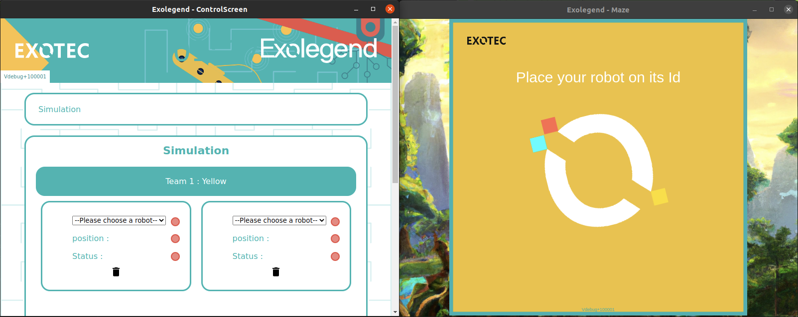

Vérification de votre installation
^^^^^^^^^^^^^^^^^^^^^^^^^^^^^^^^^^

    **Attention !** Pour continuer, il faut avoir Visual Studio Code et PlatformIO
    déjà installés. Si ce n'est pas le cas je vous invite à suivre la documentation
    de préinstallation.

1. Ouvrir Visual Studio Code
~~~~~~~~~~~~~~~~~~~~~~~~~~~~

    * Ouvrez un terminal

    * Allez dans le dossier du repo d'exolegend
        .. code-block:: bash

            cd exowork/exolegend-win

    * Ouvrez Visual Studio Code
        .. code-block:: bash

            code  .

Vous avez maintenant l'IDE Visual Studio Code d'ouvert sur votre projet Exolegend.
Il se peut que PlatformIO installe des mises à jour ou des dépendances supplémentaires, 
dans ce cas vous aurez une notification en bas à droite : Soyez patient ;).

1. Bien s'assurer d'être dans l'environnement global
~~~~~~~~~~~~~~~~~~~~~~~~~~~~~~~~~~~~~~~~~~~~~~~~~~~~
Vérifiez que vous avez bien la disposition décrite dans l'image ci-dessous :

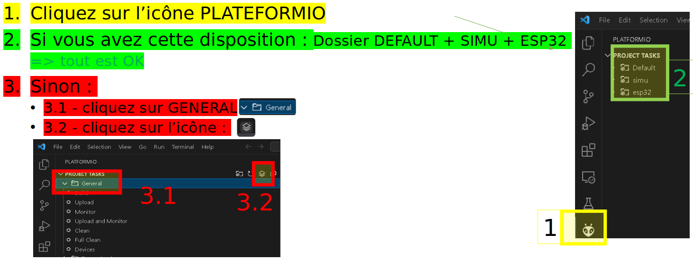

3. Vérifier que ça compile bien en simulation
~~~~~~~~~~~~~~~~~~~~~~~~~~~~~~~~~~~~~~~~~~~~~

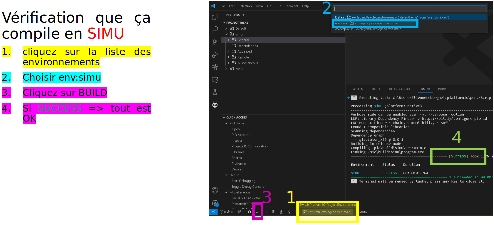

4. Vérifier que ça compile bien en réél
~~~~~~~~~~~~~~~~~~~~~~~~~~~~~~~~~~~~~~~

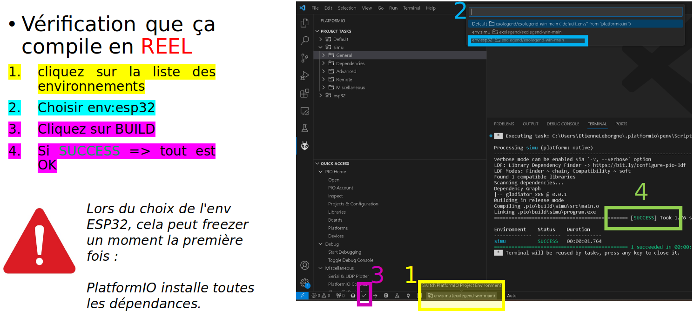

Lancer son premier robot simulé (Ghost)
^^^^^^^^^^^^^^^^^^^^^^^^^^^^^^^^^^^^^^^

+------------------------------------------------+-------------------------------------+
| Dans Visual Studio code :                      |                                     |
|     1. Cliquez sur l’icone **PLATFORMIO**      | .. image:: images/launch_ghost.png  |
|     2. Cliquez sur **SIMU**                    |     :scale: 60%                     |
|     3. Cliquez sur le sous dossier **GENERAL** |                                     |
|     4. Cliquez sur la commande **BUILD**       |                                     |
+------------------------------------------------+-------------------------------------+

Lorsque la compilation a bien réussi, vous devez vous retrouvez avec la sortie terminal qui
devrait ressembler à ceci:

.. image:: images/simu_built.png

Maintenant que le robot simulé est compilé, il faut le lancer. 
Pour cela il faut ouvrir un nouveau terminal: 

    * Cliquez sur le menu contextuel de Visual Studio Code : **Terminal**
    * Cliquez ensuite sur **Nouveau terminal**

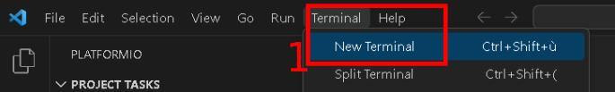

Dans la console qui apparait, tapez la commande suivante:

.. code-block:: bash

    ./ghost.bat

Voici l'output que doit donner cette commande si tout se passe bien :

.. code-block:: bash

    connect to Falcon server
    connect to Antenna server
    mac = F4:4D:DA:59:97:13
    create login message
    mac address
    robot id
    login to server
    Events binded :) 
    F4:4D:DA:59:97:13
    1706007854859 : Debug -> MEMORY setup
    1706007854859 : Debug -> KALMAN setup
    1706007854859 : Debug -> WHEELS setup
    1706007854859 : Debug -> ENABLE MOTOR setup
    1706007854859 : Debug -> PID setup
    1706007854859 : Debug -> LED setup
    1706007854859 : Debug -> before Servo setup
    [2024-01-23 12:04:14] [connect] Successful connection
    [2024-01-23 12:04:14] [connect] Successful connection
    [2024-01-23 12:04:14] [connect] WebSocket Connection 127.0.0.1:5003 v-2 "WebSocket++/0.8.2" /socket.io/?EIO=4&transport=websocket&t=1706007854 101
    [2024-01-23 12:04:14] [connect] WebSocket Connection 127.0.0.1:5002 v-2 "WebSocket++/0.8.2" /socket.io/?EIO=4&transport=websocket&t=1706007854 101
    1706007854960 : Debug -> Init com
    1706007854960 : Debug ->  ______________________________________________________________ 
    1706007854960 : Debug ->  
    1706007854961 : Debug ->      EXOLEGEND GLADIATOR - © all rights reserved ~              
    1706007854961 : Debug ->      VERSION debug
    1706007854961 : Debug ->      BUILD   100001
    1706007854961 : Debug ->  ______________________________________________________________ 

Pour quitter le programme il suffit de fermer la console.

Retournez sur le simulateur que vous avez éxecuté dans les étapes précédentes.

+----------------------------------------------+------------------------------------------------------------------+
|                                              |                                                                  |
| .. image:: images/vir_step1.png              |  Choisir le **GHOST** dans la liste déroulante                   |
|                                              |                                                                  |
+----------------------------------------------+------------------------------------------------------------------+
|                                              |                                                                  |
| .. image:: images/vir_step2.png              |  Le **GHOST** est bien connecté                                  |
|                                              |                                                                  |
+----------------------------------------------+------------------------------------------------------------------+
|                                              |                                                                  |
| .. image:: images/vir_step3.png              |  Le **GHOST** apparaît sur le terrain à son emplacement          |
|                                              |                                                                  |
+----------------------------------------------+------------------------------------------------------------------+
|                                              |                                                                  |
| .. image:: images/vir_step4.png              |  Il suffit de cliquer sur Let's go pour commencer la simulation  |
|                                              |                                                                  |
+----------------------------------------------+------------------------------------------------------------------+

Écrire son premier code
-----------------------

Arborescence du repo Exolegend
^^^^^^^^^^^^^^^^^^^^^^^^^^^^^^

Pour explorer l'arborescence des fichiers de votre projet exolegend, retounez sur Visual Studio Code et cliquez sur l'icône |code_files|
sur la barre de menu à gauche.

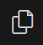

Voici à quoi doit ressembler l'arborescence de votre projet.

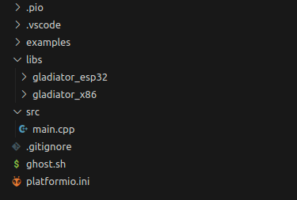

Le dossier **SRC** :
~~~~~~~~~~~~~~~~~~~~

    Ce dossier contient tout votre code source. Il doit absolument contenir un fichier ``main.cpp``. Votre programme démarrera
    toujours sur le fichier ``main.cpp``

Le dossier **EXAMPLES** :
~~~~~~~~~~~~~~~~~~~~~~~~~

    Ce dossier contient une liste d'exemples très exhaustive pour bien commencer et bien comprendre la librairie.
    Je vous conseil d'ailleurs de commencer à partir d'un exemple.
    Pour utiliser un exemple il suffit de copier le code de l'exemple dans votre fichier ``main.cpp``.

Le dossier **LIBS** :
~~~~~~~~~~~~~~~~~~~~~

    Il contient tout le nécessaire pour faire fonctionner la librairie. Ce dossier est composé de binaires précompilés.

Le ficher **platformio.ini** :
~~~~~~~~~~~~~~~~~~~~~~~~~~~~~~

    Ce fichier définit le configuration de votre projet. Pour en apprendre davantage en ce qui concerne
    ce fichier je vous propose de visiter cette page : https://docs.platformio.org/en/latest/projectconf/index.html

Architecture du fichier ``main.cpp``:
^^^^^^^^^^^^^^^^^^^^^^^^^^^^^^^^^^^^^

    Voici comment doit ressembler votre fichier ``main.cpp``. À vous ensuite de le modifier
    comme bon vous semble en fonction de vos compétences et vos envies.
    Sachez qu'il est possible d'inclure d'autres fichiers.

    Voici un exemple de code qui peut être contenu dans le fichier ``main.cpp`` :

    .. code-block:: cpp

        #include "gladiator.h"
        Gladiator* gladiator;
        void reset();
        void setup() {
            //instanciation de l'objet gladiator
            gladiator = new Gladiator();
            //enregistrement de la fonction de reset qui s'éxecute à chaque fois avant qu'une partie commence
            gladiator->game->onReset(&reset);
        }

        void reset() {
            //fonction de reset:
            //initialisation de toutes vos variables avant le début d'un match
        }

        void loop() {
            if(gladiator->game->isStarted()) { //tester si un match à déjà commencer
                //code de votre stratégie :
                //appliquer une vitesse de 0.6m/s au deux roue
                gladiator->control->setWheelSpeed(WheelAxis::RIGHT, 0.6); //controle de la roue droite
                gladiator->control->setWheelSpeed(WheelAxis::LEFT, 0.6); //control de la roue gauche
                //Lorsque le jeu commencera le robot ira en ligne droite
                delay(100);
            }
            //La consigne en vitesse est forcée à 0 lorsque aucun match n'a débuté.
        }
    
    Étudions ensemble ce code:

    1. En tête
        .. code-block:: cpp

            #include "gladiator.h"
            Gladiator* gladiator;
            void reset();
        
        Dans un premier temps on importe la librairie Gladiator et
        on créé un pointeur vide de type Gladiator. Enfin on créé le prototype
        de la fonction de **reset**.

    2. Initialisation
        .. code-block:: cpp
            
            void setup() {
                //instanciation de l'objet gladiator
                gladiator = new Gladiator();
                //enregistrement de la fonction de reset qui s'éxecute à chaque fois avant qu'une partie commence
                gladiator->game->onReset(&reset);
            }

        La fonction setup s'éxecute lors du démarrage du robot. Elle permet d'initialiser
        toutes les variables. Dans cet exemple j'initialise la variable gladiator.
        
        La fonction **onReset** permet de definir quelle fonction sera appelée lors du reset.
        La fonction de reset est appelée avant chaque début de match.
    
    3. La fonction de reset
        .. code-block:: cpp
            
            void reset() {
                //fonction de reset:
                //initialisation de toutes vos variables avant le début d'un match
            }

        Définition de la fonction de reset: mettre toutes les réinitialisations nécessaires pour
        pouvoir effectuer un nouveau match (réinitialiser des variables à zéro etc ...)
        Cette fonction est appelée avant chaque match. Bien réinitialiser ces variables est très important
        pour éviter de faire des erreurs au prochain match.
    
    4. Code de votre Stratégie
        .. code-block:: cpp
            
            void loop() {
                if(gladiator->game->isStarted()) { //tester si un match à déjà commencer
                    //code de votre stratégie :
                    //appliquer une vitesse de 0.6m/s au deux roue
                    gladiator->control->setWheelSpeed(WheelAxis::RIGHT, 0.6); //controle de la roue droite
                    gladiator->control->setWheelSpeed(WheelAxis::LEFT, 0.6); //control de la roue gauche
                    //Lorsque le jeu commencera le robot ira en ligne droite
                    delay(100);
                }
                //La consigne en vitesse est forcée à 0 lorsque aucun match n'a débuté.
            }

        La fonction loop contient votre code de stratégie. Cette fonction s'éxecute à l'infini.

        Utilisez la fonction ``gladiator->game->isStarted()`` pour éviter de faire des calculs alors qu'aucune partie n'a pas commencée.

    
    Vous trouverez plus de détails sur la librairie en lisant le document ``049645-1 Features and Api Exolegend 2024``.

    Voilà, maintenant vous avez de quoi vous amusez avec tous ces exemples. Je vous conseille de partir d'un 
    exemple et d'essayer de flasher un robot.

Flasher son premier robot
-------------------------

Enfin l'étape tant attendue, vous allez pouvoir enfin avoir un robot qui fonctionne. Je vous partage maintenant
les différentes étapes pour télécharger votre code sur votre robot.

Dans un premier temps munissez vous de votre robot entièrement assemblé et d'un cable USB (micro-USB vers USB).

Ensuite il faut allumer le robot, en switchant l'interrupteur sur la position **ON**, comme le montre l'image ci-dessous:

.. image:: images/switch_on.jpg

Retournez ensuite dans Visual Studio Code :

+-----------------------------------------------+-----------------------------------+
| 1. Cliquez sur l'icone PlatformIO             |                                   |
| 2. Cliquez sur **ESP32**                      | .. image:: images/flash_robot.png |
| 3. Cliquez sur **UPLOAD**                     |                                   |
+-----------------------------------------------+-----------------------------------+

**Attention** : si vous avez une erreur de ce genre là :

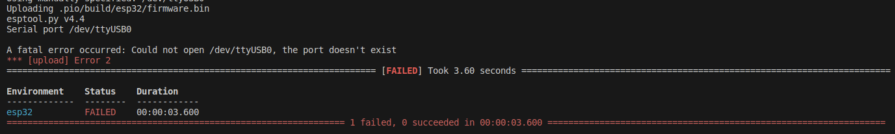

Il faut sélectionner le bon port série, pour ce faire : sélectionnez l'icône en forme de prise électrique.

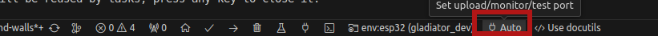

Vous avez ensuite la liste des ports série qui s'affichent, dans l'exemple ci-dessous mon robot est connecté
sur le port ``/dev/ttyUSB0``. 

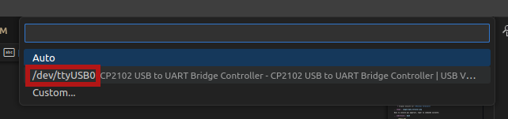

Sous Windows le nom des ports vont de ``COM0`` à ``COM9``. Si votre PC détecte plusieurs
ports séries, celui du robot doit avoir l'appellation ``CP2102 USB to UART Bridge Controller | ...``.

**Si ça ne marche toujours pas**

1. Vérifiez que votre robot est bien allumé et bien connecté à votre PC
2. Pour les Windowsiens, si vous n'avez pas installé le driver Polulu lors de l'étape de Préinstallation, il y'a des chances que ça ne fonctionne pas.
3. Supprimez le dossier ``.pio`` situé à la racine de votre projet, déconnectez et reconnectez le robot. Réessayez de nouveau.
4. Appelez un coach pour vous venir en aide.

**Bien enlever le port USB**

Pour éviter d'abîmer le port USB du robot, ne pas secouer le cable. Il vaut mieux tirer sur le câble comme
le montre cette photo :

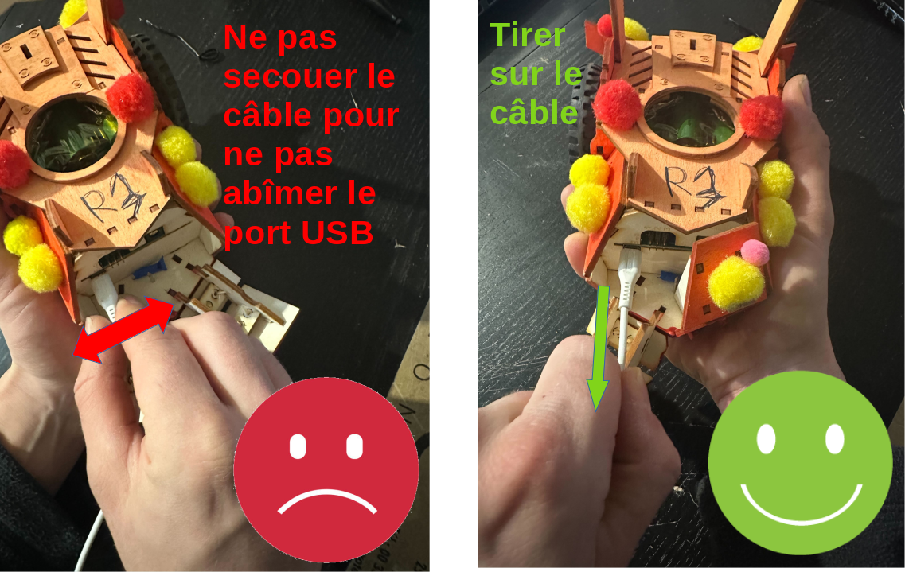

Utiliser une arène pour lancer un match
---------------------------------------

Lorsque votre robot est bien flashé, vous pouvez maintenant le tester sur une arène.

Réserver une arène de test
^^^^^^^^^^^^^^^^^^^^^^^^^^

Utilisez Discord

Lancer un match
^^^^^^^^^^^^^^^

+----------------------------------------------------------------------------------------------------------------+--------------------------------------------+
| Allez sur l'écran d'une **ARENA**                                                                              | .. image:: images/arena.png                |                    
+----------------------------------------------------------------------------------------------------------------+--------------------------------------------+
| Cliquez sur un encart                                                                                          | .. image:: images/arena_screen.png         |  
+----------------------------------------------------------------------------------------------------------------+--------------------------------------------+
| Scannez un QRCODE sous le robot                                                                                | .. image:: images/scan_qr.png              |
+----------------------------------------------------------------------------------------------------------------+--------------------------------------------+
| Positionnez votre robot avec un ballon sur l'endroit indiqué sur le terrain **MAZE**.                          | .. image:: images/position_robot.png       |
+----------------------------------------------------------------------------------------------------------------+--------------------------------------------+
| S'il est bien positionné, la zone devient verte ( Attention à bien mettre la planchette à l'horizontal )       | .. image:: images/position_ok.png          |
+----------------------------------------------------------------------------------------------------------------+--------------------------------------------+

Le FreeMode
-----------

Le freeMode permet de débrider le **Gladiator**, cela permet de le faire fonctionner sans qu'il soit connecté
à une Arene. Ce mode est pratique pour tester la cinématique de votre robot et vos armes (si vous avez des 
armes intelligentes)

Pour passer en freeMode, ajoutez la ligne suivante dans la fonction ``setup()``. 
**Attention** à bien l'ajouter après l'initialisation de l'objet ``gladiator``:

.. code-block:: cpp

    gladiator->game->enableFreeMode(RemoteMode::OFF);

Après avoir flashé votre robot en freeMode :
    * Les LEDS du **Gladiator** clignotent de toutes les couleurs et le code du robot s'exécute.
    * Le Gladiator se déplace !

Pour plus d'infos, je vous invite à voir l'exemple ``freemode_simple`` et ``freemode_master``.
    * l'exemple ``freemode_simple`` : fait tourner le robot sur lui même
    * l'exemple ``freemode_master`` : utilise des fonctions plus avancées

